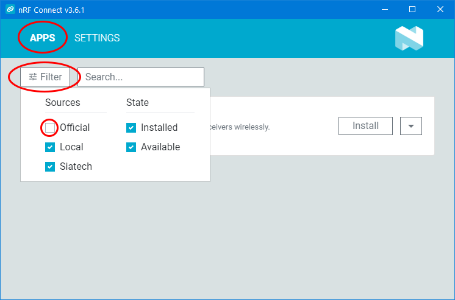

# Outils de mise à jour et configuration SIAtech

## Installation

### Gestionnaire d'application

*Cette étape n'est à réaliser qu'une seule fois*

- Télécharger et installer [nRF Connect](https://www.nordicsemi.com/-/media/Software-and-other-downloads/Desktop-software/nRF-Connect-for-Desktop/3-11-1/nrfconnect-setup-3.11.1-ia32.exe)
- Lancer nRF Connect
- Cliquer sur **Settings** > **Add Source**

  

- Coller le lien suivant dans la boite de dialogue: [https://raw.githubusercontent.com/siatech/nrf-tools/main/apps.json](https://raw.githubusercontent.com/siatech/nrf-tools/main/apps.json)

  

- Cliquer sur **Add**
- La nouvelle source apparaît 

  

- Revenir sur l'onglet **APPS** puis cliquer sur **Filter** et décocher la case **Official**

  

### Ajout d'applications

- Cliquer sur le bouton **Install** de l'application à installer

  

## Lancement
- Cliquer sur le bouton **Open** de l'application à lancer

  

### Création d'un raccourci

- Cliquer sur la flèche à côté du bouton **Open**, puis sur **Create Shortcut**
  
  

- Un raccourci est créé sur le bureau

  
